# MediaHub Serverless Contact Workflow — Deployment

Deployed a serverless contact submission workflow on AWS where customer requests are received through API Gateway, processed by Lambda, stored in DynamoDB, and reported through SNS email notifications.

The deployment was validated end-to-end to confirm that the customer request, database storage, and notification workflow were functioning correctly.

---

## AWS Services Used

 AWS Service         | Purpose                                           

 **API Gateway**     - Receives `POST /contact` requests                 
 **AWS Lambda**      - Processes contact submissions                     
 **DynamoDB**        - Stores submitted contact information              
 **SNS**             - Sends email notifications                         
 **IAM**             - Provides Lambda access to required AWS services   
 **CloudWatch Logs** - Supports execution monitoring and troubleshooting 

---

# Deployment Implementation

## 1. Configure SNS Notification Topic

Created the `MediaHub-Contact-Notifications` SNS topic and configured an email subscription for contact submission alerts.

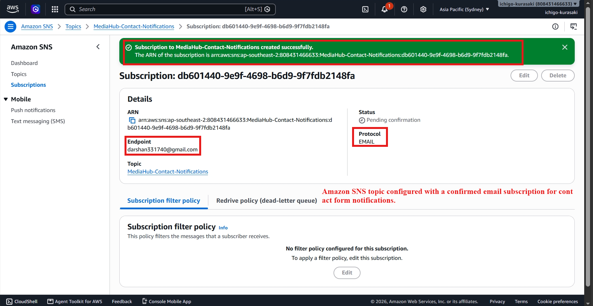


---

## 2. Create DynamoDB Storage

Created the `MediaHub-Contacts` DynamoDB table using `SubmissionId` as the partition key to uniquely identify each submission.

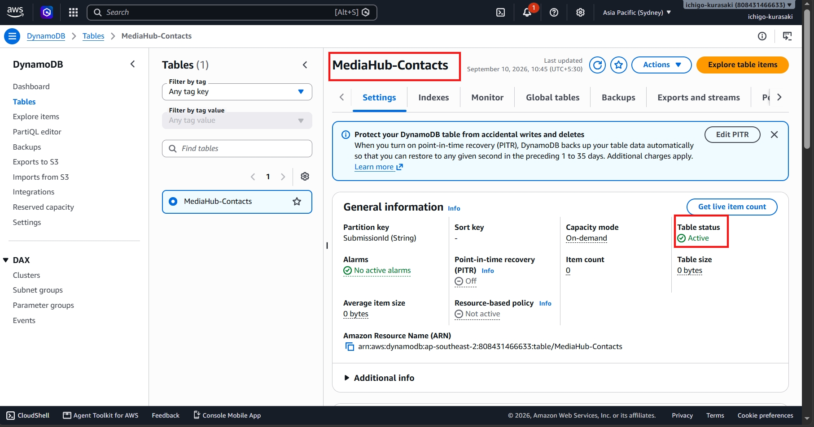

---

## 3. Configure Lambda Environment Variables

Configured the `MediaHub-ContactHandler` Lambda function with environment variables for the DynamoDB table and SNS topic.

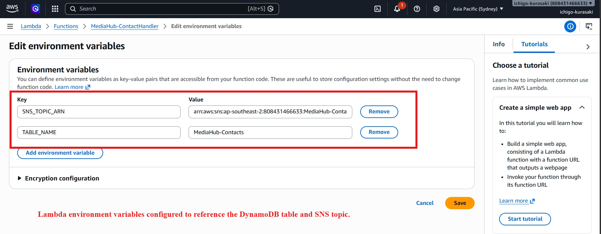

---

## 4. Configure Lambda IAM Permissions

Configured the Lambda execution role with permissions required to interact with DynamoDB and SNS.

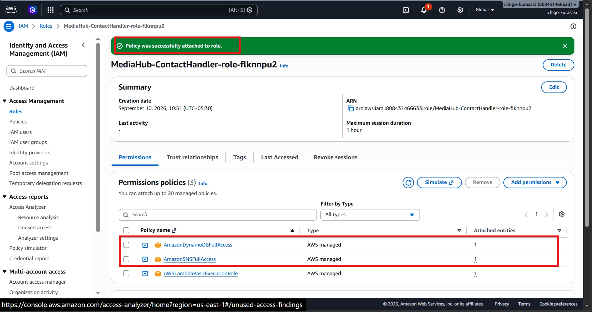

---

## 5. Validate Lambda Processing

Executed a test event against Lambda to verify that a contact submission could be processed successfully.

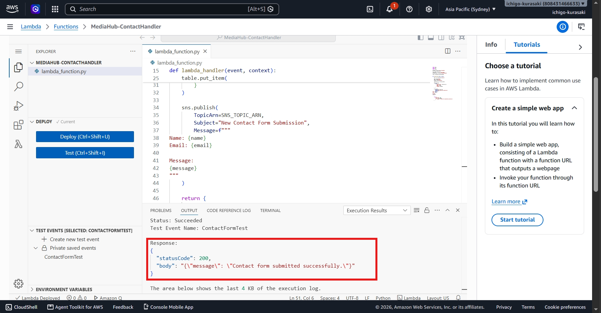


---

## 6. Validate DynamoDB Persistence

Verified that the Lambda execution successfully created a contact submission record in DynamoDB.

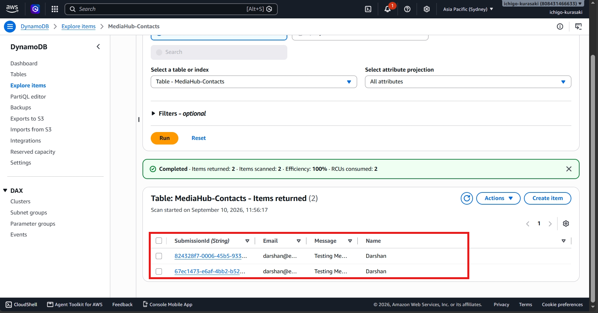


---

## 7. Validate SNS Notification

Verified that the processed contact submission generated the expected SNS email notification.

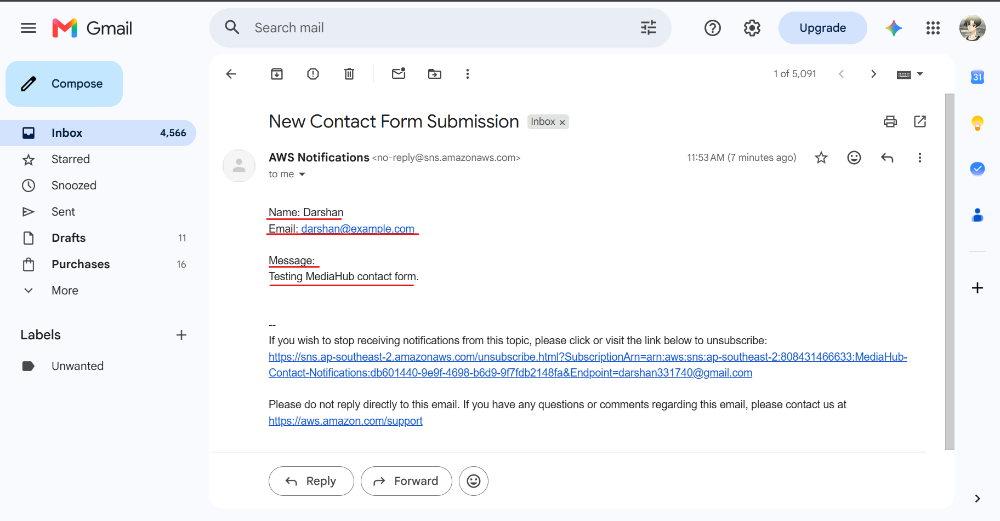

---

# API Gateway Integration

## 8. Configure HTTP API

Created the `MediaHub-ContactAPI` HTTP API and connected it to the Lambda backend.

```text
API:         MediaHub-ContactAPI
Route:       POST /contact
Integration: MediaHub-ContactHandler
Stage:       $default
```

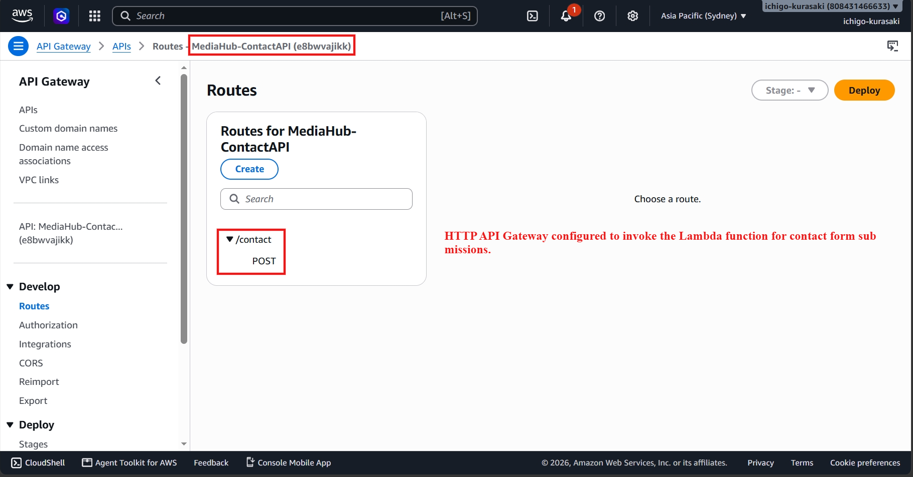

---

# End-to-End Validation

## 9. Test Contact Submission

Sent a `POST /contact` request through API Gateway and received a successful response from the deployed application.


{
  "name": "Darshan",
  "email": "darshan@example.com",
  "message": "Testing MediaHub Serverless Contact Form."
}
```

### Response


{
  "message": "Contact form submitted successfully."
}
```

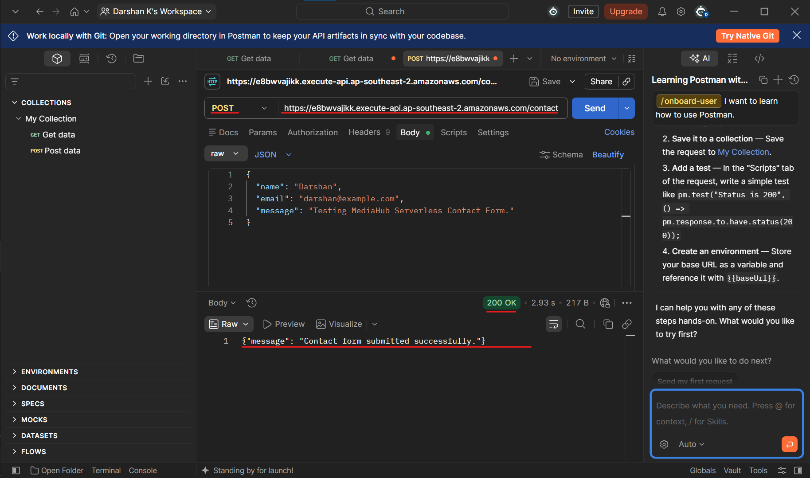

---

## 10. Verify Database Processing

Verified that the API request created a new contact record in DynamoDB.

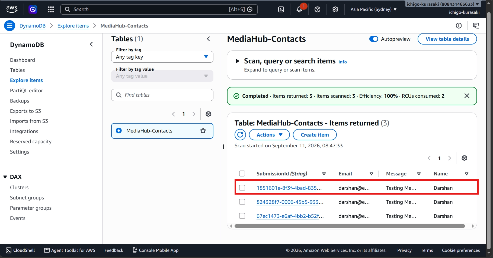


---

## 11. Verify Notification Workflow

Verified that the API request also triggered the expected SNS email notification.

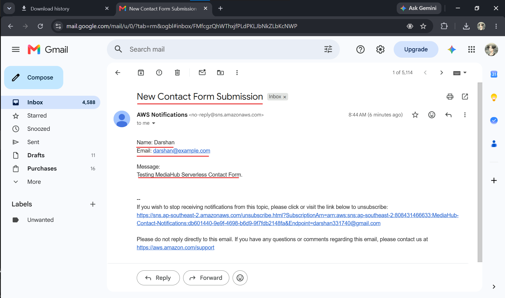


---

# Relevance

This deployment provides a foundation for production-style cloud troubleshooting scenarios.

The project demonstrates practical experience with:

* AWS service configuration
* Lambda troubleshooting
* API Gateway troubleshooting
* DynamoDB operations
* SNS integrations
* IAM permissions
* CloudWatch Logs
* End-to-end validation
* Root-cause analysis
* Incident response and recovery

---

# Incident Troubleshooting

After validating the healthy deployment, controlled incidents are introduced to simulate common cloud support problems.

Each incident follows a structured troubleshooting approach:


See the `incidents/` directory for detailed incident reports.

---

## Outcome

Successfully deployed and validated a serverless contact workflow using AWS API Gateway, Lambda, DynamoDB, SNS, IAM, and CloudWatch.

The project demonstrates both **AWS implementation skills and practical Cloud Support troubleshooting capability**, with evidence captured for each major deployment and validation stage.

