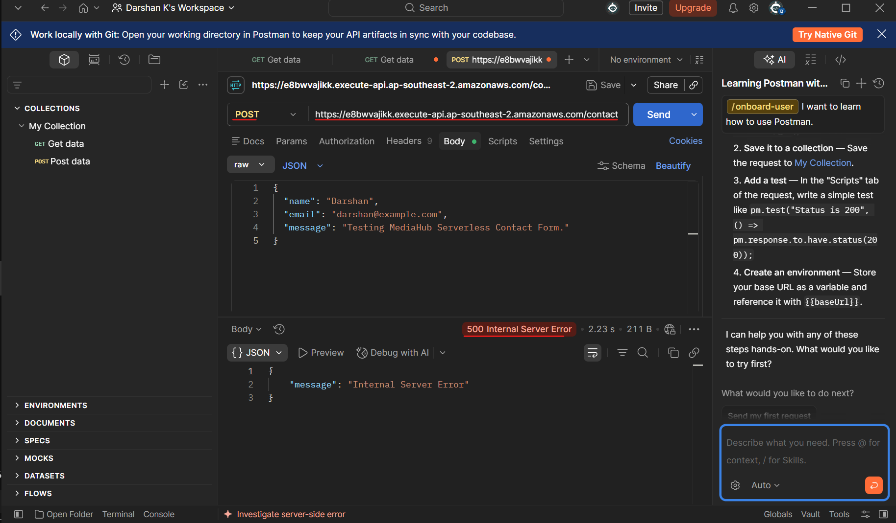
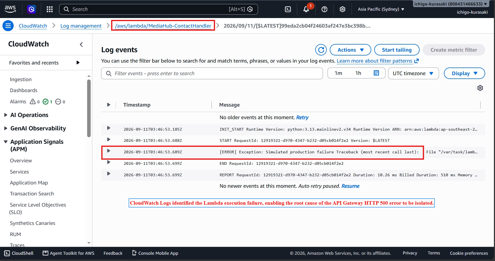
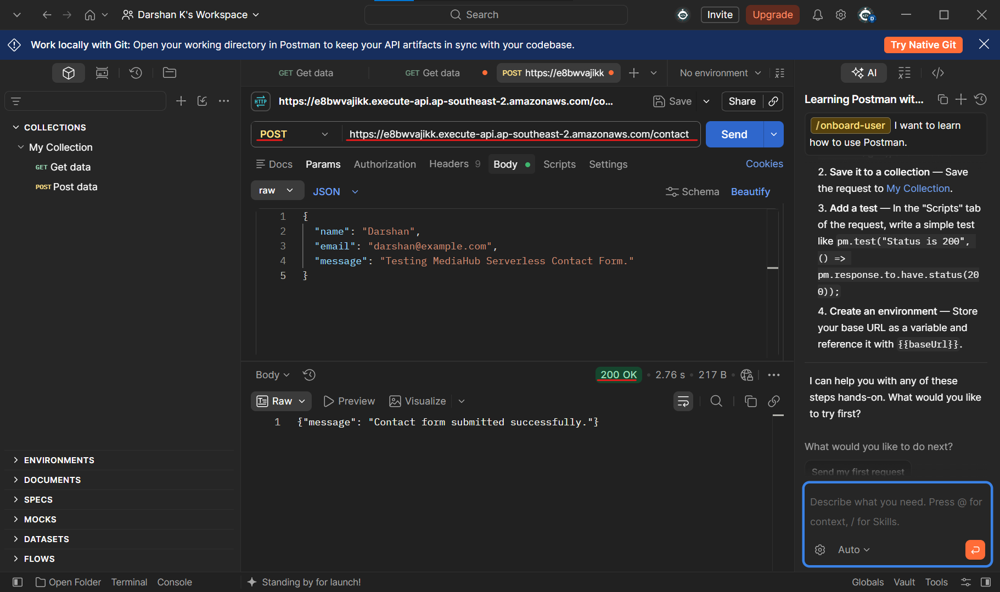
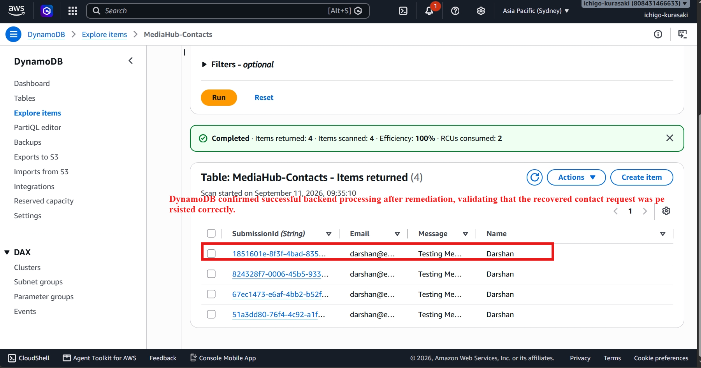

# Incident 01 — API Gateway HTTP 500

## Incident Summary

A customer contact request through API Gateway returned **HTTP 500**, causing the contact submission workflow to fail.

**Impact:** Customer submissions could not be successfully processed during the incident.

**Root Cause:** A Lambda execution failure caused API Gateway to return HTTP 500.

---

## Troubleshooting & Resolution

### 1. Reproduce the Failure

A POST request was sent to the `/contact` endpoint and returned HTTP 500.

### 2. Investigate CloudWatch Logs

CloudWatch Logs were reviewed to identify the Lambda execution error.

### 3. Apply Remediation

The failing Lambda exception was removed and the corrected function was deployed.

### 4. Validate Recovery

The same API request was retried and successfully returned HTTP 200.

### 5. Validate Backend Processing

The recovered request was verified in DynamoDB to confirm successful data persistence.

---
## Final Validation
API request returned HTTP 200
Lambda processed the request successfully
DynamoDB stored the submission successfully
Customer-facing workflow was restored

## Skills Demonstrated
- API Gateway troubleshooting
- AWS Lambda troubleshooting
- CloudWatch Logs investigation
- Root-cause analysis
- Production-style incident response
- Targeted remediation
- End-to-end recovery validation
