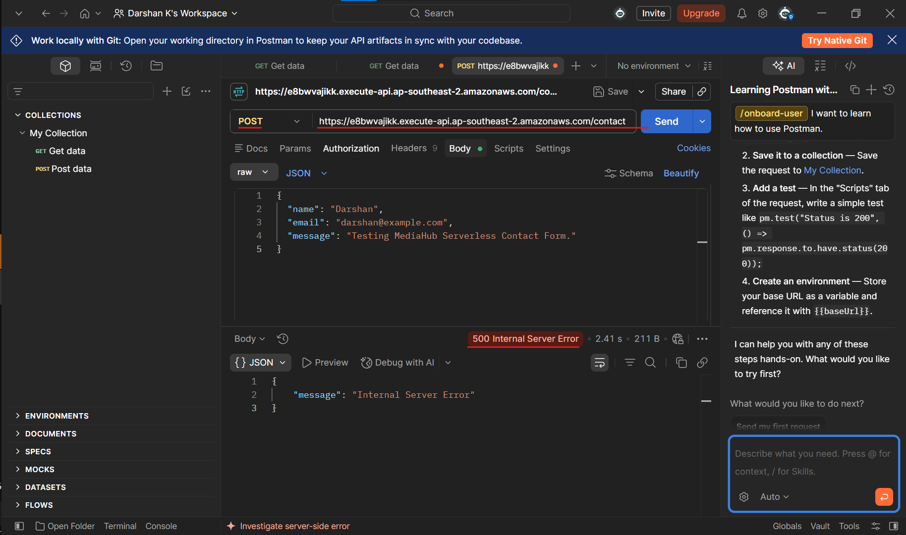
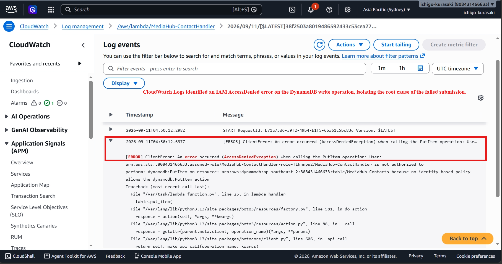
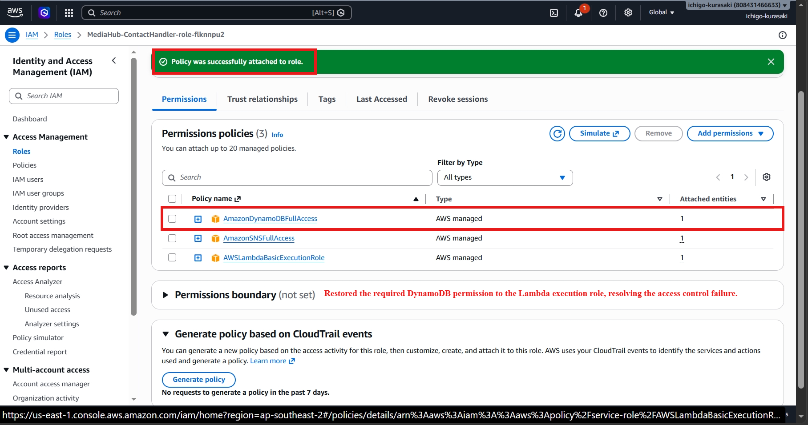
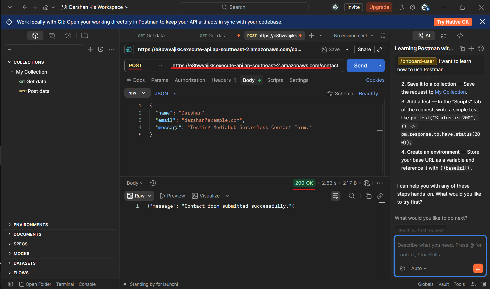
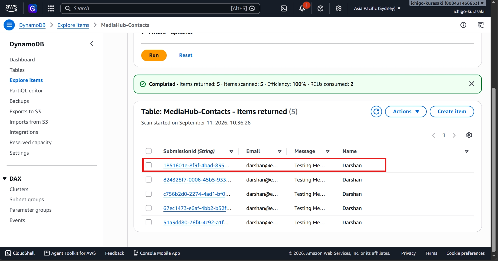

# Incident 02 – DynamoDB IAM Permission Failure

## Overview

During a controlled troubleshooting exercise, the DynamoDB permission required by the Lambda function was intentionally removed to simulate an IAM access failure.

As a result, the contact API returned an HTTP 500 error because Lambda could no longer write submissions to DynamoDB. The objective was to identify the permission failure, restore the required IAM access, and validate successful backend processing.

---

## 1. Incident Introduced – DynamoDB Access Denied

The DynamoDB permission was removed from the Lambda execution role while the SNS permission remained available.

The API was then tested using Postman.

**Observed Impact**

> The contact API returned HTTP 500 because Lambda was unable to access DynamoDB.

---

## 2. Investigation

CloudWatch Logs were reviewed to identify the underlying Lambda failure.

The logs showed an **AccessDeniedException** for the DynamoDB `PutItem` operation, confirming that the Lambda execution role lacked the required DynamoDB permission.

### Root Cause

The Lambda execution role did not have permission to perform the required DynamoDB `PutItem` operation.

---

## 3. Resolution

The required DynamoDB permission was restored to the Lambda execution role.

The Lambda function was then tested again through the API Gateway endpoint.

---

## 4. API Recovery

The API successfully processed the contact submission after DynamoDB access was restored.

**Recovery Result**

> The API returned a successful response, confirming that the IAM permission issue was resolved.

---

## 5. Final DynamoDB Validation

DynamoDB was reviewed to confirm that the recovered contact submission was successfully persisted.

The new record was visible in the `MediaHub-Contacts` table with the expected submission details.

---

## Troubleshooting Workflow

**Identify API Failure -> Review CloudWatch Logs -> Identify AccessDeniedException -> Restore IAM Permission -> Retest API -> Validate DynamoDB Record**

---

## Skills Demonstrated

- AWS IAM
- AWS Lambda
- Amazon DynamoDB
- Amazon API Gateway
- Amazon CloudWatch Logs
- Access Control Troubleshooting
- Root Cause Analysis
- Incident Resolution
- Least-Privilege Awareness

---

## Key Takeaway

This incident demonstrates how an IAM permission misconfiguration can cause a serverless application failure. By tracing the HTTP 500 error through CloudWatch Logs, identifying the DynamoDB access denial, restoring the required permission, and validating the database record, the complete API workflow was successfully recovered.
