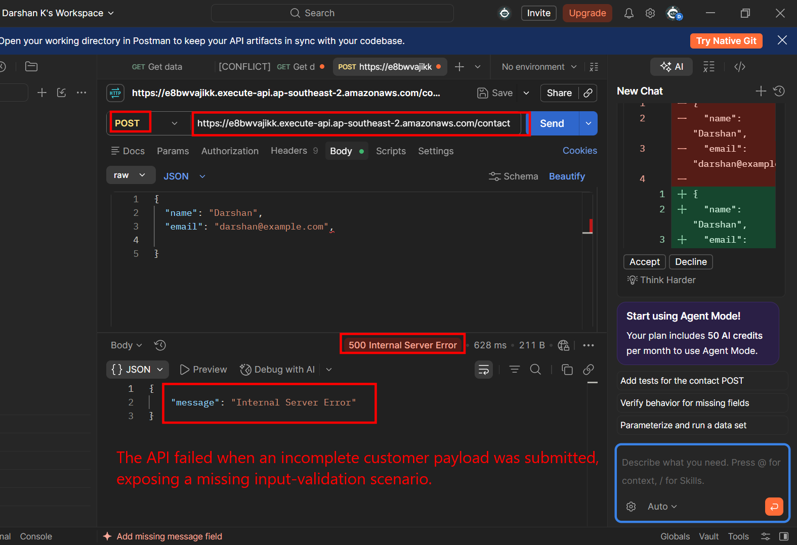
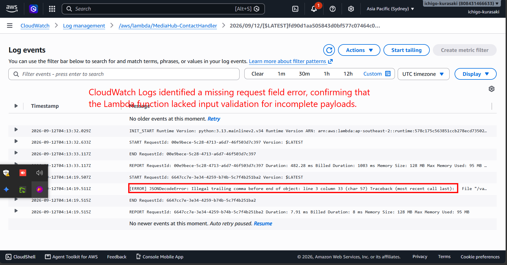
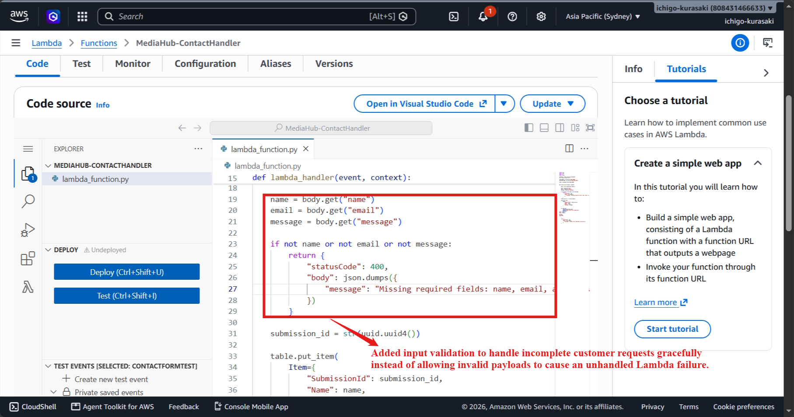
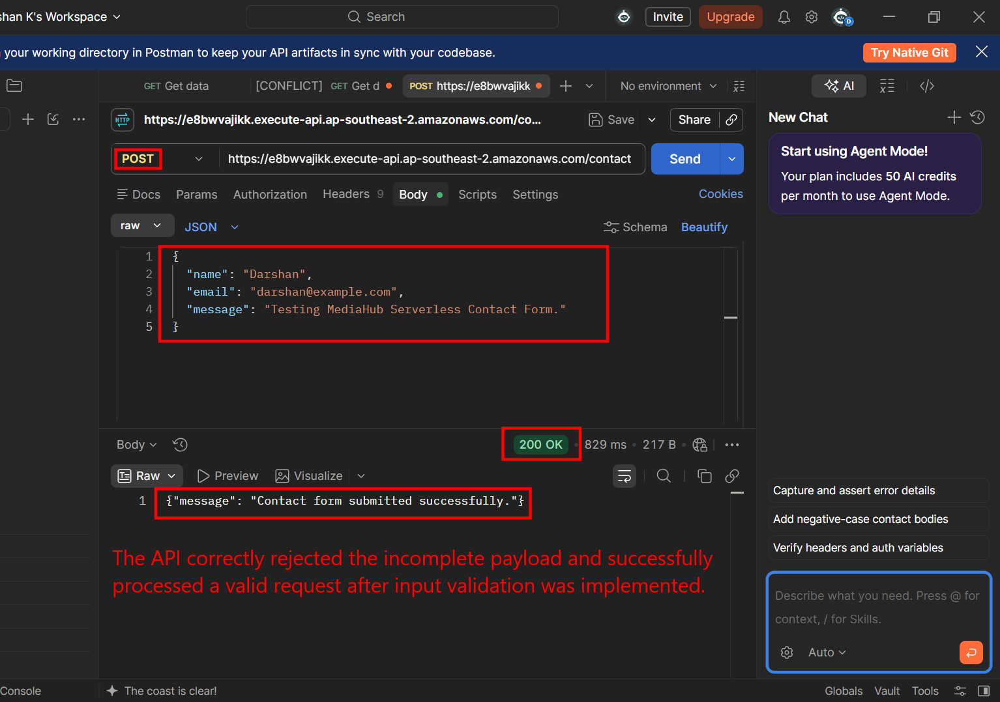

# Incident 05 – Invalid Request Payload Handling

## Incident Summary

A controlled invalid request scenario was introduced by sending an incomplete contact form payload that was missing the required `message` field.

The Lambda function initially attempted to access the missing field directly, causing an unhandled error and an HTTP 500 response.

---

## 1. Incident Introduced – Invalid Payload

An incomplete JSON payload was intentionally submitted through Postman without the required `message` field.

**Observed Impact**

> The API failed when an incomplete customer request was submitted, exposing a missing input-validation scenario.

---

## 2. Investigation

CloudWatch Logs were reviewed to identify the Lambda execution failure.

The logs showed a missing request field error, confirming that the Lambda function did not validate incomplete payloads before processing them.

### Root Cause

The Lambda function directly accessed required fields from the request body without validating whether those fields were present.

---

## 3. Resolution

Input validation was added to check whether `name`, `email`, and `message` were provided before processing the request.

**Resolution**

> Added input validation to handle incomplete customer requests gracefully instead of allowing invalid payloads to cause an unhandled Lambda failure.

---

## 4. API Recovery

The API was tested again after implementing input validation.

The incomplete payload was handled with a controlled response, and a valid contact request was successfully processed.

**Recovery Result**

> The API correctly rejected the incomplete payload and successfully processed a valid request after input validation was implemented.

---

## 5. Final DynamoDB Validation

The DynamoDB table was checked to confirm that the valid contact submission was successfully stored after the validation fix.

**Final Validation**

> Verified successful backend processing by confirming that the valid contact submission was stored in DynamoDB after input validation was implemented.

---

## Troubleshooting Workflow

**Identify API Failure -> Review CloudWatch Logs -> Identify Missing Request Field -> Implement Input Validation -> Retest API -> Validate DynamoDB Record**

---

## Skills Demonstrated

- AWS Lambda
- Amazon API Gateway
- Amazon DynamoDB
- Amazon CloudWatch Logs
- Request Validation
- Serverless Troubleshooting
- Root Cause Analysis
- Incident Resolution
- End-to-End Validation

---

## Key Takeaway

This incident demonstrates the ability to troubleshoot an API failure caused by invalid customer input, analyze Lambda errors through CloudWatch Logs, implement input validation, and validate successful backend processing after remediation.
