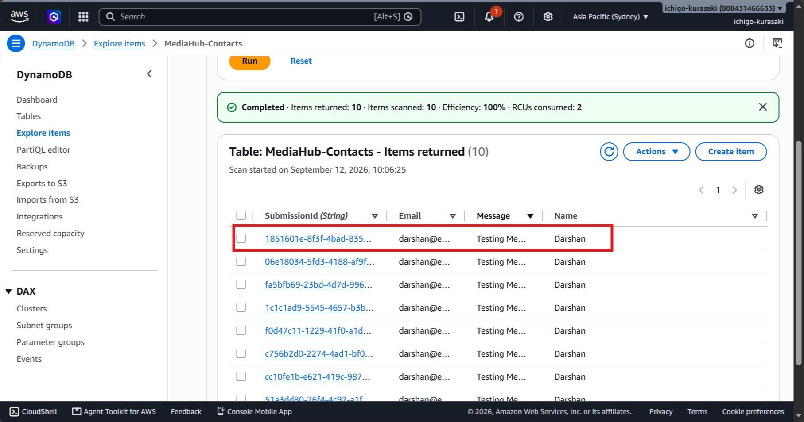

# Incident 04 – Missing Lambda Environment Variable

## Incident Summary

A controlled environment variable failure was introduced by changing the valid DynamoDB table name in the Lambda environment variables to an invalid table name.

The contact API then failed because Lambda could not access the configured DynamoDB resource.

---

## 1. Incident Introduced – Environment Variable Failure

The `TABLE_NAME` environment variable was intentionally changed to an invalid DynamoDB table name and the API was tested through Postman.

**Observed Impact**

> The contact API returned HTTP 500 after the database configuration was invalidated, demonstrating the customer-facing impact of the environment variable failure.

---

## 2. Investigation

CloudWatch Logs were reviewed to identify the Lambda execution failure.

The logs showed a DynamoDB resource error, confirming that the configured table name was invalid.

### Root Cause

The Lambda function was configured with an invalid `TABLE_NAME`, preventing it from accessing the required DynamoDB table.

---

## 3. Resolution

The invalid `TABLE_NAME` was replaced with the correct value for the `MediaHub-Contacts` DynamoDB table.

**Resolution**

> Restored the correct DynamoDB table configuration in the Lambda environment, resolving the application configuration failure.

---

## 4. API Recovery

The API was tested again after restoring the correct environment variable.

The contact request was successfully processed and returned HTTP 200.

**Recovery Result**

> The API successfully processed the contact request after restoring the correct environment variable, confirming recovery from the configuration failure.

---

## 5. Final DynamoDB Validation

The DynamoDB table was checked to confirm that the recovered contact submission was successfully stored.

**Final Validation**

> Verified successful backend processing by confirming that the recovered contact submission was stored in DynamoDB.

---

## Troubleshooting Workflow

**Identify API Failure -> Review CloudWatch Logs -> Identify Environment Variable Error -> Restore Correct Configuration -> Retest API -> Validate DynamoDB Record**

---

## Skills Demonstrated

- AWS Lambda
- Amazon DynamoDB
- API Gateway
- CloudWatch Logs
- Environment Variable Configuration
- Serverless Troubleshooting
- Root Cause Analysis
- Incident Resolution
- End-to-End Validation

---

## Key Takeaway

This incident demonstrates the ability to troubleshoot a serverless configuration failure by tracing an API error through Lambda and CloudWatch Logs, identifying an incorrect environment variable, restoring the correct configuration, and validating successful backend processing.
