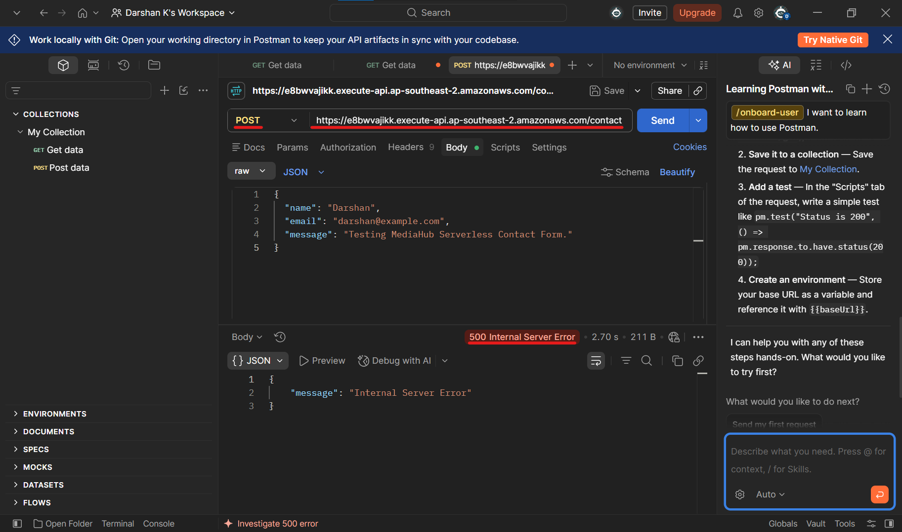
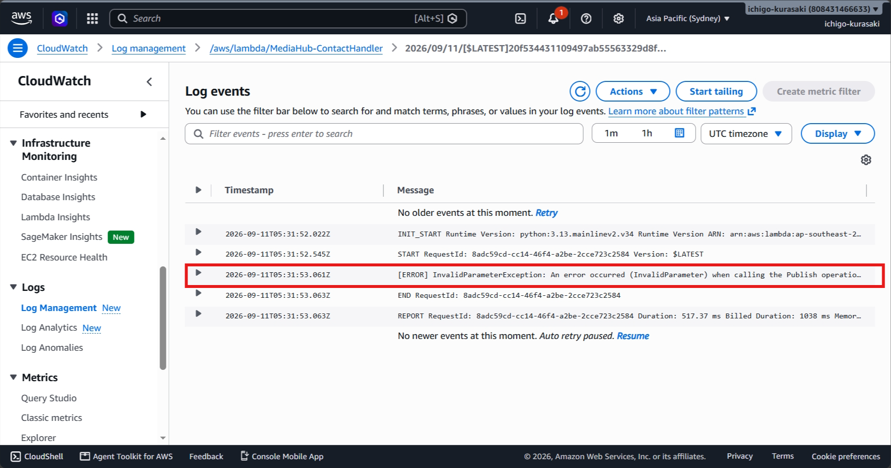
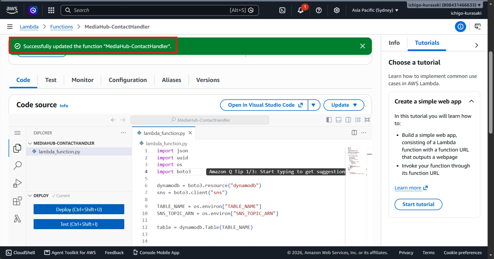
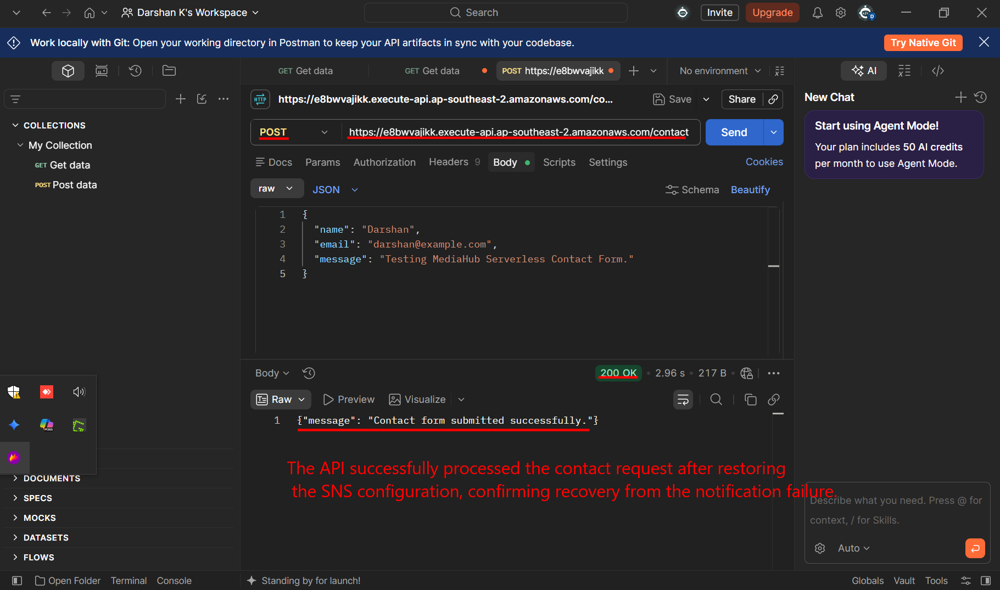
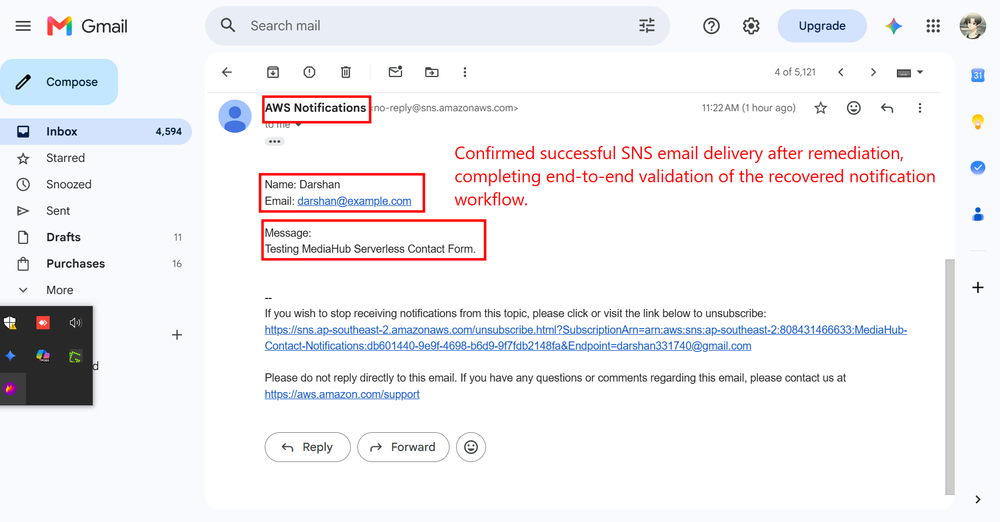

# Incident 03 – SNS Notification Failure

## Incident Summary

A controlled SNS configuration failure was introduced by replacing the valid SNS topic ARN in the Lambda environment variables with an invalid topic ARN.

The contact API then failed because Lambda could not publish the notification to SNS.

---

## 1. Incident Introduced – SNS Failure

The `SNS_TOPIC_ARN` environment variable was intentionally changed to an invalid SNS topic ARN and the API was tested through Postman.

**Observed Impact**

> The contact API returned HTTP 500 after the SNS configuration was invalidated, demonstrating the customer-facing impact of the notification failure.

---

## 2. Investigation

CloudWatch Logs were reviewed to identify the Lambda execution failure.

The logs showed an SNS publishing error, confirming that the configured notification topic was invalid.

### Root Cause

The Lambda function was configured with an invalid `SNS_TOPIC_ARN`, preventing it from publishing the contact notification.

---

## 3. Resolution

The invalid SNS ARN was replaced with the correct ARN for the `MediaHub-Contact-Notifications` topic.

**Resolution**

> Restored the correct SNS topic configuration, resolving the notification routing failure.

---

## 4. API Recovery

The API was tested again after restoring the SNS configuration.

The contact request was successfully processed and returned HTTP 200.

**Recovery Result**

> The API successfully processed the contact request after restoring SNS configuration, confirming recovery from the notification failure.

---

## 5. Final SNS Validation

The SNS email subscription was checked and the notification generated by the recovered API request was successfully received.

**Final Validation**

> Confirmed successful SNS email delivery after remediation, completing end-to-end validation of the recovered notification workflow.

---

## Troubleshooting Workflow

**Identify API Failure -> Review CloudWatch Logs -> Identify SNS Configuration Error -> Restore Correct SNS ARN -> Retest API -> Validate Email Notification**

---

## Skills Demonstrated

- AWS Lambda
- Amazon SNS
- API Gateway
- CloudWatch Logs
- Environment Variable Configuration
- Serverless Troubleshooting
- Root Cause Analysis
- Incident Resolution
- End-to-End Validation

---

## Key Takeaway

This incident demonstrates the ability to troubleshoot a serverless notification failure by tracing an API error through Lambda and CloudWatch Logs, identifying an incorrect SNS configuration, restoring the correct configuration, and validating successful email delivery.
